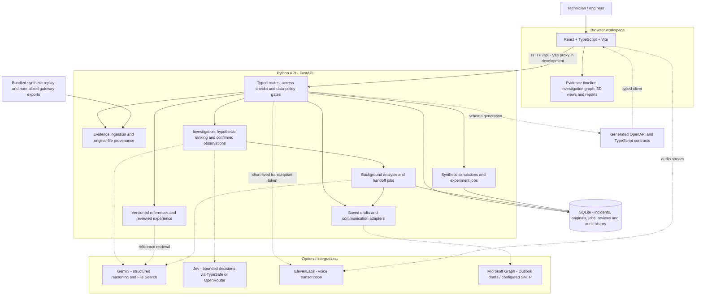

# FlowPilot

**Turn industrial dispensing defects into evidence-backed investigations and engineer handoffs.**

FlowPilot helps technicians investigate fluid-dispensing problems before the root cause is known. It brings images, machine logs, operator observations, competing explanations and proposed checks into one incident workspace, then preserves the investigation in a report engineers can review.

The current prototype demonstrates an **Asymtek S932 / DJ-2200 / BFS** incident using synthetic evidence. Run the complete replay locally without equipment, a model API key or an email account. Optional integrations add AI-assisted conversations, reference retrieval, voice input and Outlook drafts.

> **Prototype status:** The replay, images and experiments are illustrative. FlowPilot is not validated for production diagnosis, cannot control equipment, and does not replace approved maintenance procedures or engineering judgment.

[Quick start](#quick-start) · [Demo walkthrough](#demo-walkthrough) · [Architecture](#system-architecture) · [Development](#development) · [Documentation](#documentation)

## Why FlowPilot

An incident rarely arrives with complete evidence. FlowPilot keeps the investigation useful while records are still being collected: missing information stays visible, several explanations can remain open, and a partial handoff can be prepared without claiming a confirmed cause.

| Capability | What you can do |
| --- | --- |
| Evidence workspace | Compare good/bad images, inspect a source timeline, retain original files and record corrections with provenance. |
| Guided investigation | Answer adaptive questions, confirm observations and compare evidence-linked hypotheses while preserving unknowns and contradictions. |
| Visual explanations | Explore a 3D mechanism schematic, compare candidate mechanisms and use 2D/text fallbacks. |
| Simulated experiments | Review bounded plans, run synthetic conditions and return consistent simulated findings for a proposed manual check. |
| Engineer handoff | Edit and save a draft, export an assessment report, and download an unsent email with the report attached. |
| Reviewed learning | Review conclusions, publish experience and explore relationships between cases, symptoms, components and reference passages. |

Analysis and handoff jobs run independently, so a saved draft can progress while evidence collection continues. Historical cases provide context; they do not automatically establish the cause of a new incident.

## Quick start

### Prerequisites

- Node.js **22.12+** and npm **10+**.
- Python **3.12** and **uv** on your PATH.
- macOS, Linux or WSL for the mock command below.

Run these commands from the repository root:

```sh
git clone https://github.com/JiaLe331/FlowPilot.git
cd FlowPilot
npm ci
uv sync --locked
npm run db:migrate
npm run dev:mock
```

Open **[FlowPilot](http://127.0.0.1:5173)** and choose **Open workspace**, or go directly to **[the incident workspace](http://127.0.0.1:5173/incidents)**. The API runs at `http://127.0.0.1:8000`, with interactive API documentation at `/docs`.

`dev:mock` enables demo access and automatic background analysis/handoff jobs, and disables external reasoning and Jev calls. A fresh checkout needs no `.env` file. Dependencies require an initial download; the bundled incident replay needs no separate vision-model download. Saved incidents use a local SQLite database, `flowpilot.db`. Run migrations again after pulling updates. Press **Ctrl+C** to stop both services.

With Make installed, use `make install`, then `make start`. Use `make dev` to run with your configured settings.

<details>
<summary>Windows PowerShell</summary>

The `dev:mock` script uses POSIX environment assignments. In native PowerShell, install dependencies and migrate as above, then set the equivalent variables explicitly:

```powershell
$env:FLOWPILOT_INCIDENT_AUTH_MODE = "demo"
$env:FLOWPILOT_INCIDENT_AUTO_PROCESS = "true"
$env:FLOWPILOT_REASONING_ENABLED = "false"
$env:FLOWPILOT_INCIDENT_JEV_ENABLED = "false"
npm run dev
```

If the PowerShell npm launcher fails, use `npm.cmd` in place of `npm`.

</details>

## Demo walkthrough

1. **Start S932 replay** in the incident workspace. FlowPilot saves an incident and an initial handoff draft while background jobs begin.
2. **Collect and inspect evidence.** Open Evidence to compare images and examine progressive machine records, timestamps and source files.
3. **Investigate competing causes.** Confirm answers and compare restriction, unstable delivery and material-change mechanisms. Hardware and software investigation branches remain available; the scored replay mechanisms cover hardware/material explanations.
4. **Explore and test an explanation.** Use the mechanism view and run a simulated experiment. Review the saved conditions and results before returning a consistent simulated finding to the investigation.
5. **Prepare the handoff.** Save message edits and export the Markdown report, printable A4 HTML report or unsent `.eml` email with the report attached. Use the browser's print dialog to save the HTML report as PDF.
6. **Review and learn.** Record a supported or inconclusive closure, then review experience before publication. New evidence can reopen the review gate.

Simulation outputs stay distinct from observed evidence. Exporting a report or email does not send a message. The mock communication flow lets you explore delivery states without sending real mail.

For a detailed walkthrough, see the [incident workspace guide](docs/S932_INCIDENT_WORKSPACE.md) and [demo script](docs/S932_DEMO_SCRIPT.md).

## System architecture



Solid arrows show the local application path; dashed arrows show generated contracts or optional integrations. Background workers run inside the API process and persist job state in SQLite. Incident originals are stored in the database; the separate legacy photo pipeline stores its model and assessments under `.cache/vision/`.

The default investigation uses deterministic rules and explicit confirmation gates. Optional provider output passes local validation and retains a deterministic fallback when unavailable, invalid or timed out. Pydantic/OpenAPI schemas define the API contract; generated TypeScript declarations keep the browser client aligned with it.

### Technology stack

| Layer | Technologies |
| --- | --- |
| Web application | React, TypeScript, Vite, Three.js, React Flow and Cytoscape |
| API and validation | Python, FastAPI and Pydantic |
| Persistence | SQLite, SQLAlchemy and Alembic migrations |
| Optional AI and voice | Google Gen AI SDK, Gemini File Search, Jev and ElevenLabs |
| Legacy photo inspection | PyTorch, torchvision and a PatchCore-style anomaly prototype |
| Verification | Node tests, pytest, Playwright, ESLint, Ruff and TypeScript |

## Optional integrations

Copy `.env.example` to the ignored root `.env`, configure only the integrations you need, and restart using `npm run dev`. Keep keys on the backend; never put secrets in `VITE_*` variables.

| Integration | Configuration and guide |
| --- | --- |
| Gemini reasoning | Set `GEMINI_API_KEY` and `FLOWPILOT_REASONING_ENABLED=true`. See the [incident integration guide](docs/S932_INCIDENT_WORKSPACE.md#optional-integrations). |
| Reference retrieval | Index the reference and enable `FLOWPILOT_INCIDENT_RAG_ENABLED`. See [investigation RAG](docs/INVESTIGATION_RAG.md) for upload policy, citations and source limits. |
| Jev decisions | Enable `FLOWPILOT_INCIDENT_JEV_ENABLED` and configure TypeSafe or OpenRouter credentials. See the [incident integration guide](docs/S932_INCIDENT_WORKSPACE.md#optional-integrations). |
| Voice input | Configure `ELEVENLABS_API_KEY` and enable `FLOWPILOT_INCIDENT_VOICE_ENABLED`. See [investigation voice](docs/INVESTIGATION_VOICE.md). Hands-free replies use browser speech synthesis. |
| Outlook drafts | Configure a Microsoft Entra application and backend credentials. See [Outlook setup](docs/OUTLOOK.md). The connector saves a real draft for review in Outlook; it does not send it. |
| SMTP sending | Requires configured credentials, recipient allowlisting, send permission and approval of the current snapshot. See the [communication guide](docs/S932_INCIDENT_WORKSPACE.md#optional-integrations). |

The external-data policy defaults to `synthetic_only`. See `.env.example` for available settings and the incident guide for configured access permissions. Demo access is intended for local demonstrations; a pilot needs configured authentication and an approved data policy.

## Development

### Repository layout

```text
apps/
  web/                    React workspace, visualizations and report exports
  api/
    src/flowpilot/        API, investigation, evidence, knowledge and providers
    migrations/           Versioned database migrations
packages/contracts/       Generated OpenAPI schema and TypeScript declarations
fixtures/                 Replay evidence, sample logs and test scenarios
scripts/                  Contract generation, indexing and evaluation tools
src/ingestion/            JavaScript reference log parser
test/                     Node tests and browser journeys
docs/                     Product scope, integration guides and validation records
```

### Useful commands

| Command | Purpose |
| --- | --- |
| `npm run dev:mock` | Start the local demo with automatic analysis/handoff jobs. |
| `npm run dev` | Start the API and browser app with configured settings. |
| `npm run dev:api` / `npm run dev:web` | Run either service separately. |
| `npm run db:migrate` | Apply database migrations. |
| `npm run contracts:generate` | Regenerate OpenAPI and TypeScript contracts after API changes. |
| `npm run contracts:check` | Check generated contracts for drift. |
| `npm run check` | Run lint/format checks, types, Node/API tests, contract checks and the web build. |
| `npm run test:e2e` | Run browser journeys against isolated test services. |

Install the browser once before running end-to-end tests:

```sh
npx playwright install chromium
npm run test:e2e
```

An installed Chrome is also supported with `PLAYWRIGHT_CHANNEL=chrome npm run test:e2e` on POSIX shells. See the [development guide](docs/DEVELOPMENT.md) for contracts, module boundaries and test setup.

When contributing, describe the incident or workflow your change improves, keep provider behavior optional, and regenerate contracts when API schemas change. Include the relevant validation results in your pull request. Track bugs and proposals in [GitHub Issues](https://github.com/JiaLe331/FlowPilot/issues).

### Other workspaces

| Route | Purpose |
| --- | --- |
| `/` or `/landing` | Interactive landing page. |
| `/incidents` | Current S932 incident workspace. |
| `/knowledge` | Learning Database linking saved experience and reference knowledge. |
| `/legacy` | Earlier guided-repair and photo-inspection workflows; saved `/?case=...` links remain supported. |
| `/prototype` | Offline version 2 storyboard. |
| `/log-preview` | Standalone event-log viewer. |

For legacy photo inference, run `npm run vision:setup` once to download the pretrained backbone. Inference then runs locally on CPU. See [photo inspection](docs/PHOTO_INSPECTION.md) for provenance and model limits. Older epoxy cases remain read-only.

## Scope and limitations

- The current replay tests the software workflow with synthetic records, AI-generated inspection illustrations and illustrative 3D models.
- The simulation uses declared toy equations and a small learned surrogate. Its evaluation does not establish real spray-physics accuracy, diagnostic quality or downtime savings.
- Manufacturer-approved procedures, validated equipment export mapping, physical experiments and supervised real-machine outcome studies remain pending.
- Reviewed historical experience and retrieved reference passages support investigation; neither substitutes for confirmed current evidence. The bundled S932 reference is an unverified secondary summary.
- The prototype targets a local, single-process demonstration. Outlook connections are held in API memory and require reconnection after restart; a multi-worker deployment needs shared session storage.

See the [implementation audit](docs/S932_IMPLEMENTATION_AUDIT.md), [mock evaluation](docs/S932_MOCK_EVALUATION.md) and [expert review](docs/EXPERT_REVIEW.md) for coverage and validation boundaries.

## Documentation

| Start here | Details |
| --- | --- |
| [Incident workspace guide](docs/S932_INCIDENT_WORKSPACE.md) | Feature pages, replay, API routes and integration settings. |
| [Current product requirements](docs/S932_AI_Troubleshooting_PRD.md) | S932 prototype, pilot and research scope. |
| [Development guide](docs/DEVELOPMENT.md) | Setup, commands, contracts and verification. |
| [Gateway and evidence ingestion](docs/S932_GATEWAY.md) | Read-only export adapter, checkpoints and mock fixtures. |
| [Event-log ingestion](docs/LOG_INGESTION.md) | Parser contract, provenance, warnings and production follow-ups. |
| [Learning Database](docs/DATABASE_LEARNING_PLAN.md) | Reviewed experience lifecycle and knowledge graph. |
| [Investigation RAG](docs/INVESTIGATION_RAG.md) | Reference indexing, retrieval and citation validation. |
| [Milestone log](docs/MILESTONES.md) | Development history, verification and handoffs. |

## License

No project-wide license has been added yet. Third-party assets and dependencies retain their own licenses. A project license should be selected before distributing FlowPilot as open source.
